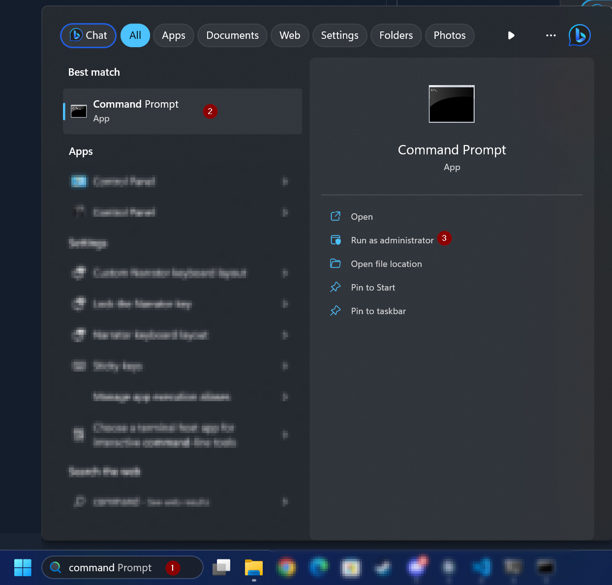
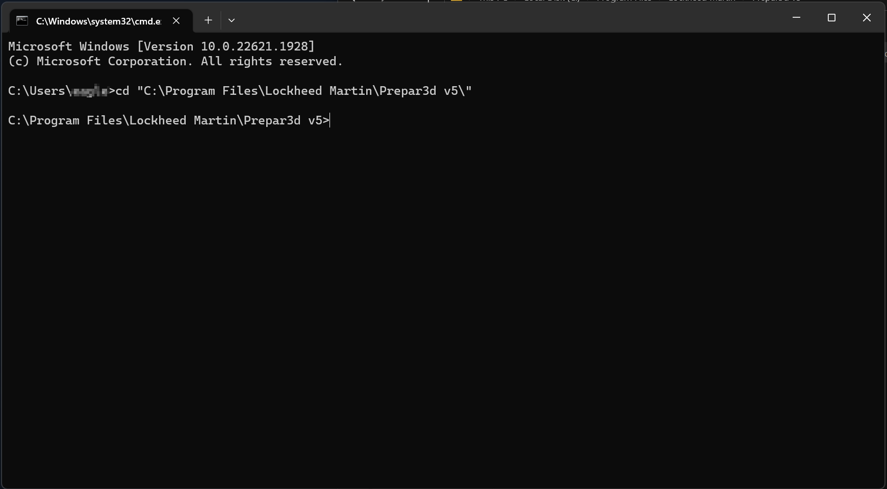
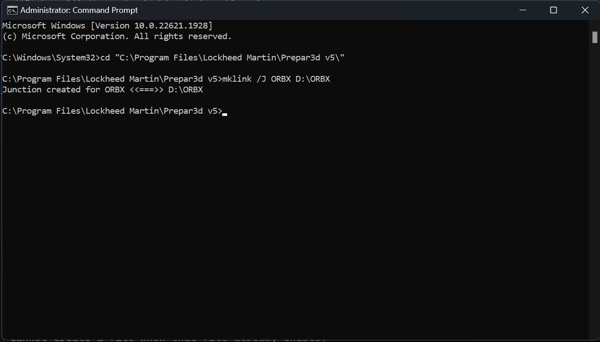

# How to create a symbolic link (on Windows) using the Windows built-in command-line (CMD)

1.	Open the Windows command-line (CMD) searching for the command prompt using the windows search-bar and running it as an administrator  
    

2.  Move to the Directory you want to create the Symlink at using the `cd ` command
      

3. Create a symbolic link to another folder (on another drive) from the cmd after changing the directory  
    