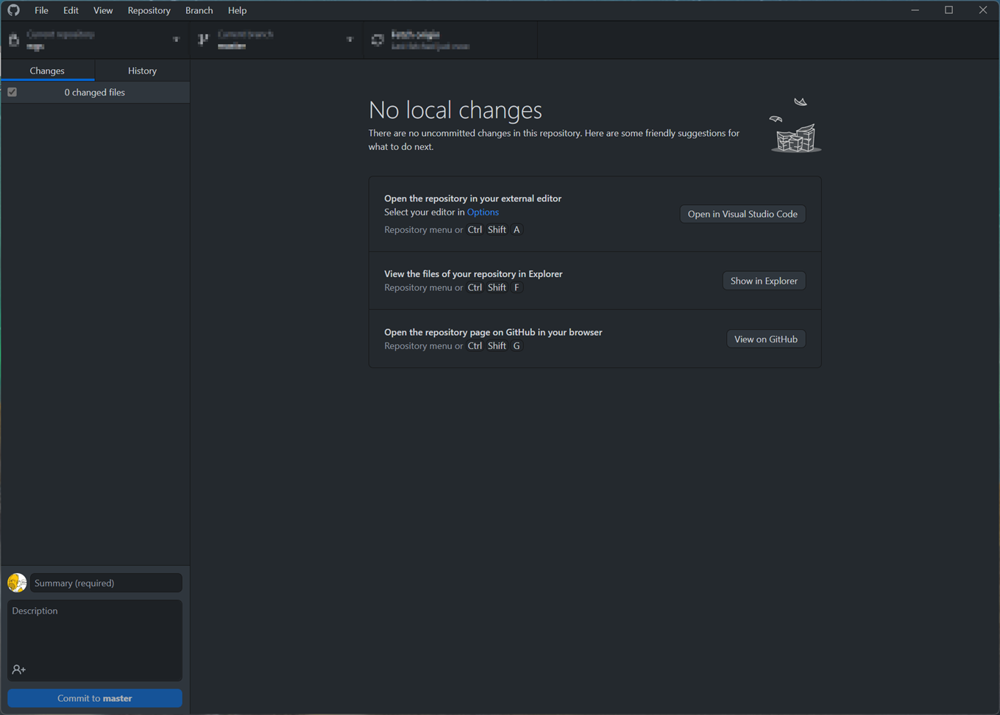
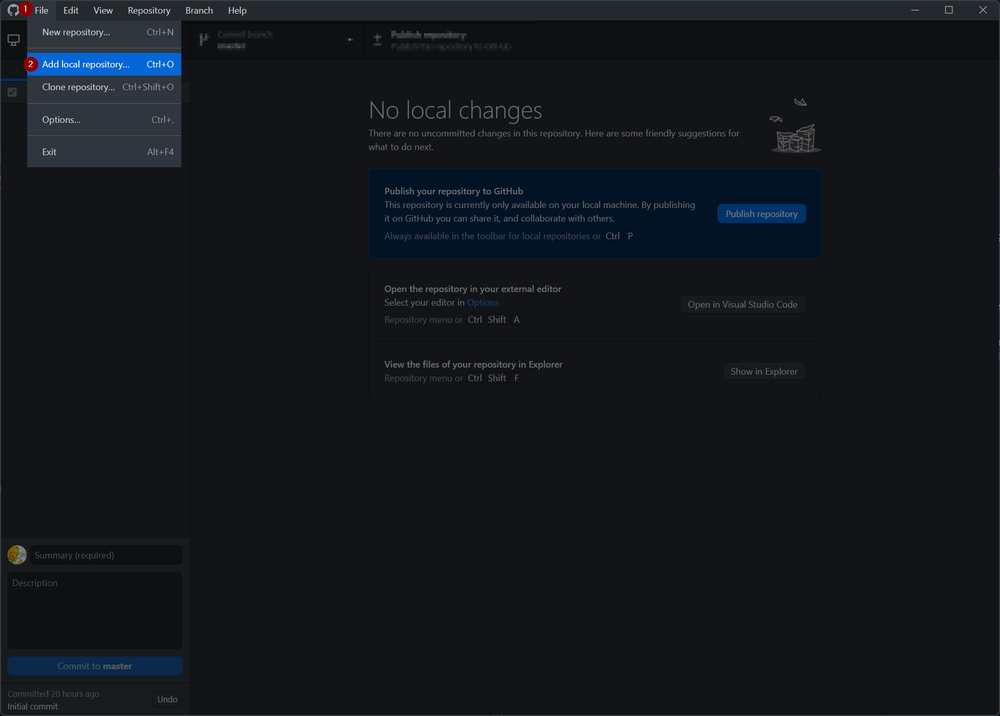
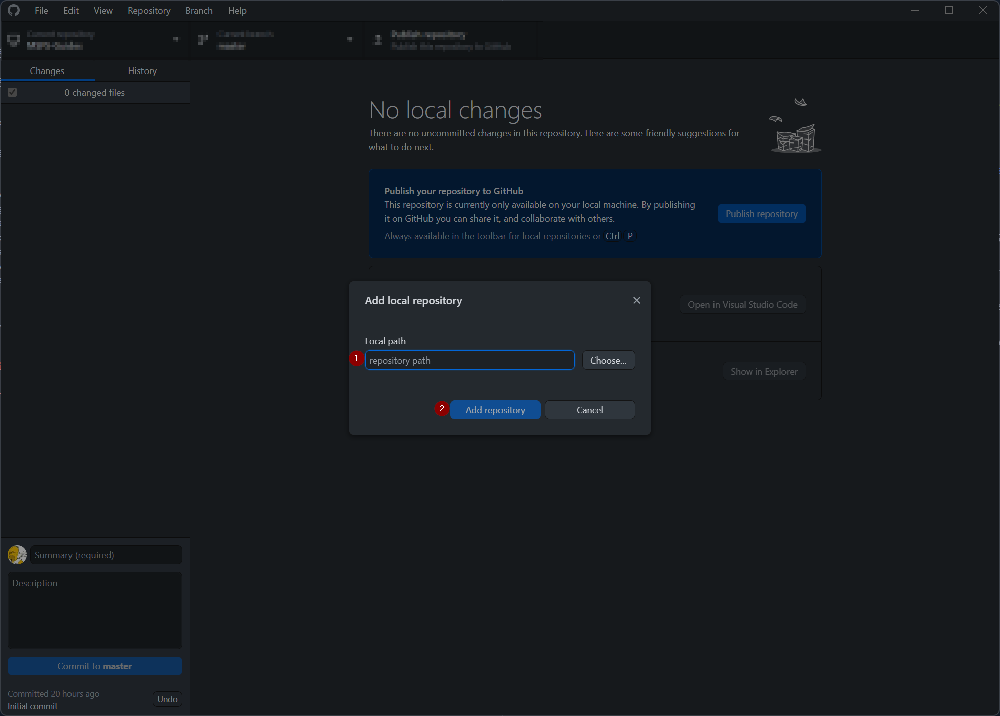
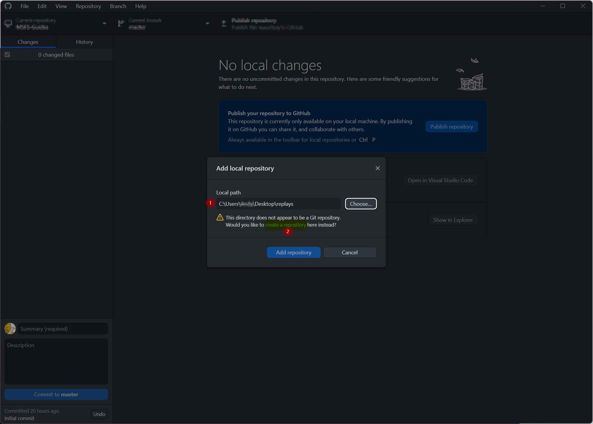
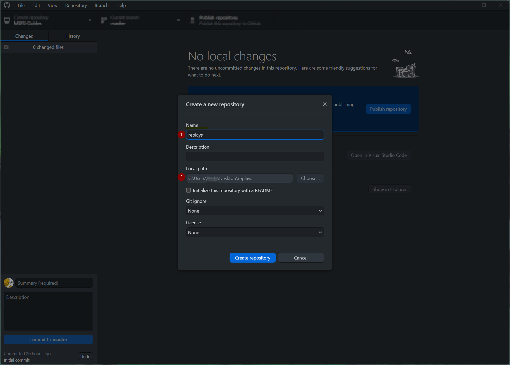
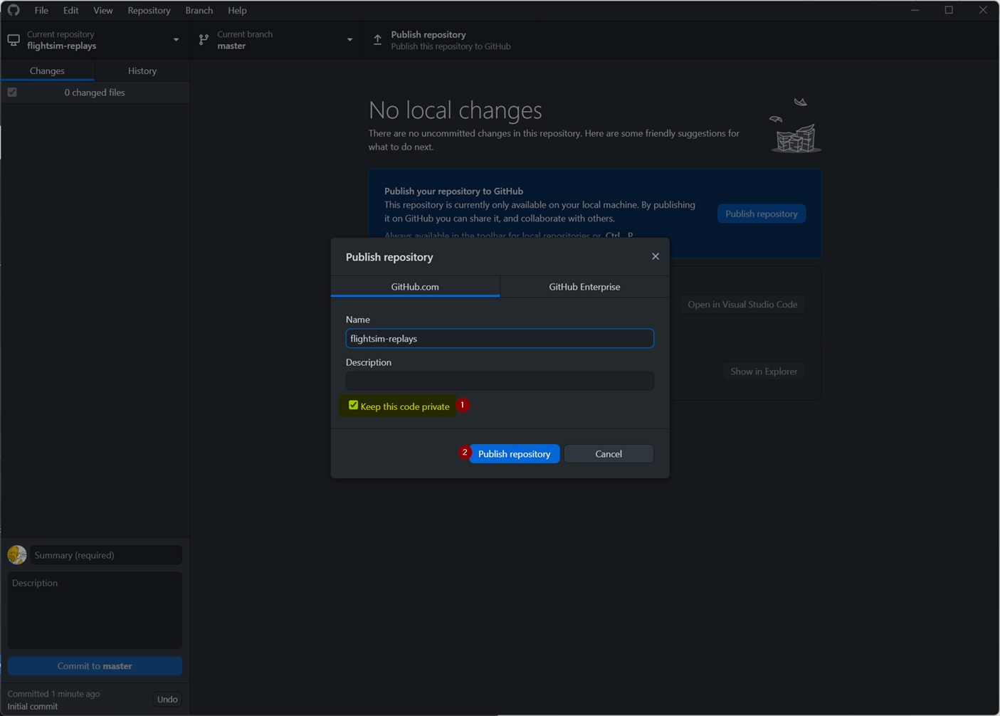
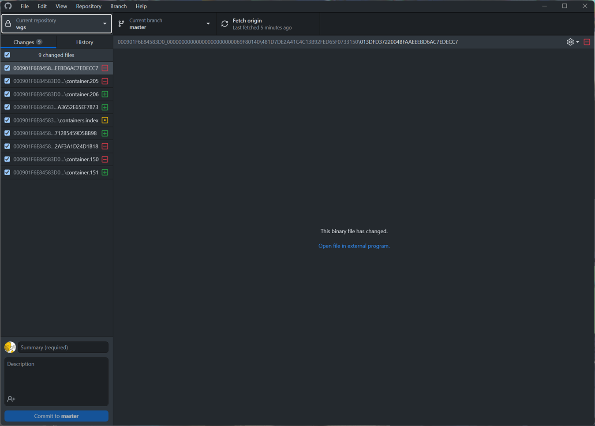
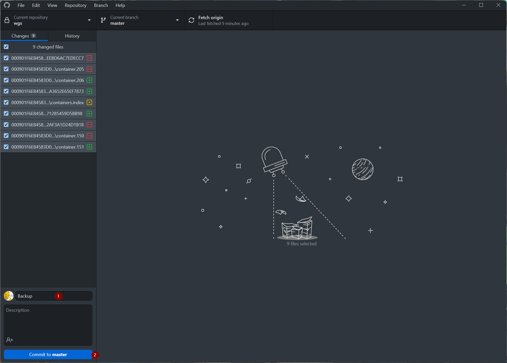
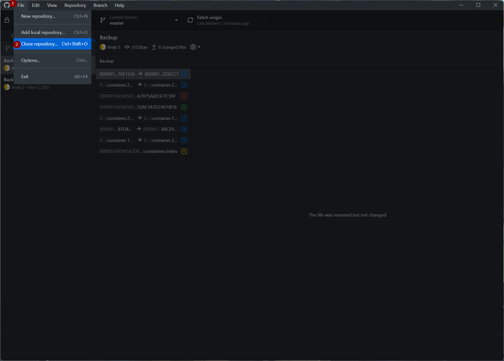
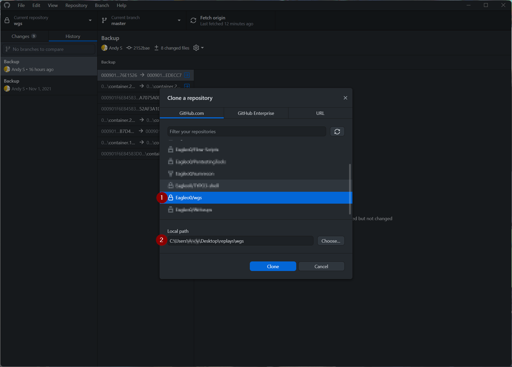

# How to save your MSFS profile and settings using git

## Setting up a Github private Repository

    
What is Git

    
Git is a free and open source distributed version control system designed to handle everything from small to very large projects with speed and efficiency. See also:  <a href="https://git-scm.com/">https://git-scm.com/</a>
    

## Saving your profile to your private git repository
1.	Create an account on https://github.com/
2.	Download the GitHub Desktop Application https://desktop.github.com/
3.	Start the GitHub Desktop Application and log in using your newly created profile

4.	Create a new private Repository (https://docs.github.com/en/repositories/creating-and-managing-repositories/about-repositories)
    * `File -> Add local Repository`
    
    *  The Local Path you need to select on the next window is the current MSFS profile path e.g.
        `C:\Users\<Username>\AppData\Local\Packages\Microsoft.FlightSimulator_8wekyb3d8bbwe\SystemAppData\wgs`
    
    
    *  Name / Description you can choose as u like
    
5.	Publish your repository to GitHub
    *   `Repository -> Push` (don’t forget to tick the “Keep this code private” box
    
6.	After publishing the new private repository with your initial settings, you can fire up MSFS
7.	Whenever you change something on your settings, or do a flight, which modifies the MSFS profile (Hours flown, Logbook) you will now have some changes available within the GitHub Desktop Application

8.	You can now save those "profile changes" on a `daily/weekly/monthly/`-basis and will be able to restore those settings to a specific point in time using your newly created private git repository
9.	To save/update your saved settings you simply must enter a “Summary” and optionally a Description for the changes (e.g., Backup) and commit the changes into your default branch.

## Restoring your profile from your private git repository
10.	Whenever Microsoft now decides to get rid of your profile and settings again you can simply restore them using the private repository you connected
11.	Depending on the state your profile is in (fully gone / new folder/profile created / …) you will need to use the `Clone functionality`

*  The Local Path you need to select on the next window is the path where your MSFS profile previously was stored e.g.
        `C:\Users\<Username>\AppData\Local\Packages\Microsoft.FlightSimulator_8wekyb3d8bbwe\SystemAppData\wgs`

&copy; Andy S. (Eagleo0)